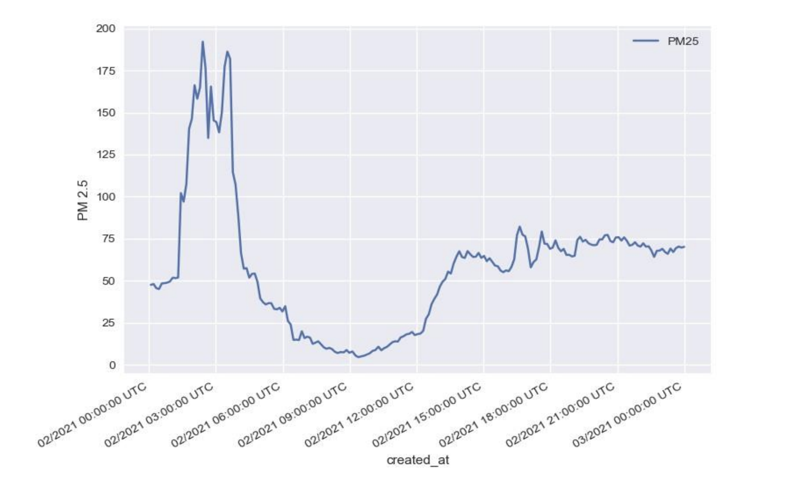

# Tanvi Kaurwar

I am a Software Engineer and Data Scientist with over three years of combined professional and research experience in building enterprise applications, predictive models, and analytical dashboards. With an M.S. in Computer Science from the University of Georgia, I bring a solid foundation in scalable system design, machine learning, and full-stack development. My professional background at FIS equipped me with the skills to engineer reliable fintech software using C#, .NET, SQL Server, and REST APIs, while my research and academic projects strengthened my expertise in Python-based data pipelines, forecasting models, and high-performance computing.

I am actively seeking full-time opportunities in software engineering, data engineering, or analytics roles where I can combine my development skills with advanced data-driven problem solving. I thrive in environments where I can design end-to-end solutions—whether that means building scalable backend services, deploying ML models on HPC clusters, or creating intuitive dashboards for non-technical users. Skilled across modern technologies such as .NET Core, Angular, Python, Tableau, Power BI, AWS, and CI/CD pipelines, I bring both technical depth and adaptability to fast-paced, collaborative teams. My goal is to contribute to organizations that value innovation, efficiency, and the impact of well-engineered software systems.  

---

### About Me
- 3+ years of combined professional and research experience across software engineering, data analytics, and machine learning.
- Designed and deployed enterprise-grade fintech applications at FIS using C#, .NET Core, SQL Server, REST APIs.
- Developed machine learning models and pipelines (XGBoost, Random Forest, ARIMA, SARIMA) for time-series forecasting and crop yield prediction, achieving measurable accuracy improvements.
- Built interactive dashboards with Tableau, Power BI, and Plotly Dash for data visualization and stakeholder reporting.
- Migrated ML workflows to HPC clusters (Sapelo2, SLURM, Linux/Bash) to optimize scalability and runtime efficiency.
- Experienced in Agile workflows, QA automation (Selenium, NUnit), and CI/CD-driven development.

---

### Tech Stack
- **Languages**: Python, C#, SQL (T-SQL, MS SQL Server), Java, JavaScript (ES6+), TypeScript.
- **Frameworks & Libraries**: .NET Core, Angular, Flask, Django, Scikit-learn, XGBoost, Pandas, NumPy.
- **Data & Visualization**: Tableau, Power BI, Plotly Dash, Excel, statistical modeling, time-series forecasting.
- **Testing & CI/CD**: NUnit, Selenium, Git, Bitbucket, JIRA, CI/CD pipelines.
- **Cloud & HPC**: AWS (fundamentals, cloud-native workflows), GACRC Sapelo2 HPC cluster, SLURM, Bash/Linux.
- **Other Tools**: Visual Studio, Microsoft SSMS, Docker (basics), UML/system design.

---

### Featured Projects
- [**AQI Prediction**](https://github.com/tanvk/AQIprediction.git):
  Developed forecasting models using ARIMA and SARIMA on real-world environmental datasets (42,000+ data points). Built a real-time web application with Angular frontend and Django backend, achieving ~80% prediction accuracy and delivering interactive dashboards for air quality monitoring.
- [**Fast Nueral Style Transfer**]():

---

### Research

**Feasibility Study of ARIMA Model for PM2.5 Prediction using Real-world Data Gathered from Pune Region**  
This paper investigates the feasibility of using the ARIMA time-series model to predict PM2.5 concentrations in Pune, India, based on real-world sensor data. The study highlights both the potential and limitations of univariate forecasting, showing that while ARIMA captures trends, external environmental and human factors significantly influence accuracy. This work laid the foundation for my later **Air Quality Forecasting & Visualization project**, where I extended the approach to include interactive dashboards, additional datasets, and more scalable machine learning methods.  

  [Read Paper](https://www.publications.scrs.in/uploads/final_menuscript/5776ce0b472ac0d2c757799363993e6e.pdf)

  

---

### Certifications
- Neural Networks and Deep Learning [(Coursera)](https://www.coursera.org/account/accomplishments/certificate/7GK8BPN92H6A)
- AWS Fundamentals: Going Cloud-Native [(Coursera)](https://www.coursera.org/account/accomplishments/certificate/RGWP2JWNYAMU)
- AWS Fundamentals: Addressing Security Risk [(Coursera)](https://www.coursera.org/account/accomplishments/certificate/N9CG6X2E47TD)

---
### Connect with Me
- [LinkedIn](https://www.linkedin.com/in/tanvi-kaurwar-779b501b0/)  
- [Email](mailto:tanvimk11@gmail.com)  
